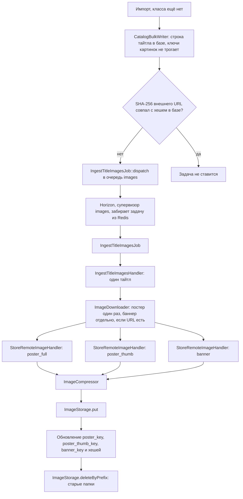

# Сжатие изображений и выгрузка в объектное хранилище

Техническое задание на реализацию медиа-пайплайна каталога.

Относится к пунктам ТЗ: 4.2.4, 4.2.5, 6.3.1, 6.3.2 (шаги 1-2), 6.3.3 (шаг 7), 7.2.
Опирается на архитектурные правила из [How_infrastructure_works.md](How_infrastructure_works.md)
и соглашения из [Development_conventions.md](Development_conventions.md).

---

## 1. Цель

Система получает от поставщиков ссылки на постеры и баннеры тайтлов. Хранить картинки
поставщика напрямую нельзя: мы не контролируем их доступность, размер и формат, а мобильный
клиент должен получать предсказуемо лёгкие файлы.

Задача — построить механизм, который по внешнему URL отдаёт готовый объект в
S3-совместимом хранилище: скачивает исходник, проверяет его, приводит к целевой геометрии и
формату, кладёт в бакет и возвращает ключ объекта. В базе остаётся только ключ, байты
картинки через PHP никогда не проходят.

### 1.1. Зачем это нужно

Замеры из раздела 1.5 показали, что исходники Shikimori и так лёгкие: медиана 99 КБ. Поэтому
изначальное обоснование «экономим место и трафик втрое» не работает, и настоящих причин
делать пайплайн три.

**Превью для сетки и поиска.** Без ресайза в плитку грида шириной около 120pt грузится
полноразмерный постер 685×975. Экран с тридцатью обложками — это 2.9 МБ против 780 КБ с
превью. Это самый крупный выигрыш по каталогу, и он получается именно из уменьшения
геометрии, а не из смены кодека.

**Срезание хвоста, а не медианы.** Медиана исходника 99 КБ, но p75 уже 204 КБ, а максимум
762 КБ. На мобильной сети тяжёлый постер даёт видимую паузу при свайпе. После обработки
максимум становится 195 КБ: смысл не в том, чтобы средняя картинка стала легче, а в том,
чтобы не осталось карточек, которые заметно тормозят.

**Аватары.** Фотография с телефона — это 3-5 МБ, из которых на выходе получается около
20 КБ, плюс вырезанные метаданные с геолокацией. Здесь выигрыш в сотни раз, и делать это
нужно независимо от того, что отдают поставщики каталога. Код при этом тот же.

Отдельно от сжатия: копии картинок всё равно обязаны лежать в нашем бакете. Прямые ссылки
на поставщика означают, что чужой сервис управляет доступностью наших карточек и может
сменить URL, упасть или начать резать хотлинк. ТЗ 5.3 требует доступности не ниже 99%, так
что шаг «скачать и сохранить к себе» не обсуждается. А поскольку файл всё равно
декодируется для проверки, сжатие добавляется к этому почти бесплатно.

### 1.2. Что входит в задачу

1. Контракты и DTO медиа-модуля в слое `Application`.
2. Реализация сжатия, скачивания и записи в хранилище в слое `Infrastructure`.
3. Конфигурация вариантов изображений (`config/images.php`).
4. Подготовка PHP-образа: поддержка WebP в GD.
5. Миграция полей тайтла под ключи объектов и хеши исходников.
6. Job и сценарий обработки картинок одного тайтла.
7. Консольная команда для ручного прогона и диагностики.
8. Отдельная очередь Horizon под медиа-задачи.
9. Unit- и feature-тесты.

### 1.3. Что в задачу не входит

| Что | Почему отложено |
| --- | --- |
| Сам импорт каталога (handler, job, расписание) | Отдельная задача; на момент этой задачи в коде есть только `ProviderClientContract` и фабрика клиентов, оркестратора импорта нет. Здесь описывается только точка стыковки |
| HTTP-ручка загрузки аватара | Появится вместе с редактированием профиля (ТЗ 6.1.4). Вариант `avatar` в конфиге определяется сейчас, чтобы ручка потом ничего не досочиняла |
| Админская загрузка постера вручную | Появится вместе с редактированием каталога (ТЗ 4.1.2.5), сядет на тот же сценарий |
| Настройка CDN в Yandex Cloud | Инфраструктурная задача вне репозитория. Код готовится так, чтобы включение CDN сводилось к одной env-переменной |
| Очистка объектов-сирот в бакете | Отдельная задача на регламентную команду |

### 1.4. Про «расжатие перед выдачей»

Пункт 4.2.4 ТЗ говорит про «расжатие данных из CDN в нормальный формат перед выдачей
пользователю». Этот шаг не реализуется, и это осознанное отклонение от текста ТЗ.

WebP и JPEG — это и есть нормальный формат доставки: клиент декодирует их сам средствами
ОС. Промежуточное декодирование на бэкенде означало бы отдачу несжатого bitmap, то есть
кратный рост трафика, и прогон всех картинок через PHP вместо CDN. Backend отдаёт в API
только URL, файл клиент забирает из CDN напрямую.

### 1.5. Замеры, на которых основано это ТЗ

Измерение выполнено на фикстуре `tests/Fixtures/Shikimori/animes.ndjson` из ветки
`645898d`: 286 реальных записей GraphQL-ответа Shikimori. Из них выдернуты все ссылки на
постеры, скачаны все 273 файла и прогнаны через `cwebp` по спецификации из раздела 3.

**Что отдаёт API.** У постера запрашивается единственное поле `poster.originalUrl` — это
самый крупный вариант, который у Shikimori есть. Поля баннера в ответе нет вообще. У 13
записей из 286 (4.5%) постера нет совсем — эти тайтлы сразу уходят в ветку неполных данных
по ТЗ 6.3.2. Все 273 файла доступны, все JPEG, все с домена `shikimori.io`.

**Геометрия и вес исходников.**

| Метрика | min | p25 | медиана | p75 | max |
| --- | --- | --- | --- | --- | --- |
| Ширина, px | 177 | 320 | 424 | 665 | 1280 |
| Высота, px | 165 | 424 | 600 | 800 | 1000 |
| Вес | 9 КБ | — | 99 КБ | 204 КБ | 762 КБ |

Ширины 1080 достигают 2% постеров, высоты 1620 — ни один. Картинки распадаются на две
группы: популярные тайтлы около 685×975, остальные около 317×450.

**Результат сжатия на целевых настройках.**

| Вариант | Медианный вес | Коэффициент (медиана) | Реально уменьшены | Выросли в объёме |
| --- | --- | --- | --- | --- |
| `poster_full` 1080×1620 q82 | 43 КБ | 2.18x | 6 из 273 | 1 из 273 |
| `poster_thumb` 360×540 q78 | 26 КБ | 3.71x | 190 из 273 | 0 из 273 |

**Прочие наблюдения.**

- ICC-профиль встретился у 7 файлов из 273. Риск потускневших цветов из-за того, что GD
  молча выбрасывает профили, на этих данных пренебрежим — вопрос GD против Imagick по
  этому основанию закрыт в пользу GD.
- Соотношение сторон: медиана 0.706 при каноническом 0.667, разброс от 0.558 до 2.113. То
  есть среди постеров есть горизонтальные. Это подтверждает решение вписывать без кропа:
  `cover` обрезал бы часть обложек.
- Progressive JPEG у 108 файлов из 273. На нас не влияет, но объясняет, зачем нужна
  нормализация формата на выходе.

**Следствия для спецификации.**

1. Целевые 1080×1620 на данных Shikimori практически не достигаются. Цифра остаётся как
   верхний предел на будущее, но считать её рабочим разрешением нельзя.
2. Ориентир ТЗ 7.2 «уменьшение в 3-5 раз» выполняется на `poster_thumb` и на аватарах и
   **не выполняется** на `poster_full` — там 2.18x, потому что уменьшать нечего. Это
   ожидаемое поведение, а не дефект реализации.
3. Прогноз объёма хранилища: в среднем 86 КБ на тайтл за оба варианта постера, то есть
   около 2.1 ГБ на 25 тысяч тайтлов. Это в четыре раза меньше, чем оценивалось до замеров.
4. У варианта `banner` в MVP нет источника данных: Shikimori баннеров не отдаёт.
5. «Сочные» постеры в свайп-ленте из Shikimori получить нельзя. Обложка 685×975 на
   карточке шириной 1062 физических пикселя растягивается в 1.55 раза — терпимо; обложка
   317×450 растягивается в 3.3 раза — выглядит плохо. Это упирается в разрешение
   источника, а не в наши настройки, и решается только сменой поставщика картинок.

**Предварительно про другие источники.** Частичная проверка AniList по тем же тайтлам (у
Shikimori в ответе есть `malId`, он служит ключом связи): обложки `coverImage.extraLarge`
читались как 460 пикселей по ширине, то есть **мельче** Shikimori; баннеры есть почти у
всех, но геометрия около 1900×400, то есть ультраширокая полоса, а не 16:9. Эти числа —
ориентир, а не факт: часть замеров не удалось подтвердить, Jikan на запросы не ответил.
За по-настоящему крупными постерами нужно идти в TMDB, где у многих тайтлов есть оригиналы
порядка 2000×3000 — не проверено, требуется API-ключ.

---

## 2. Общий поток

```text
Поставщик (внешний URL)
    -> ImageDownloaderContract        проверка и скачивание с лимитами
        -> ImageCompressorContract    декод -> поворот -> ресайз -> подшарп -> WebP
            -> ImageStorageContract   запись объекта в бакет
                -> MinIO (local) / Yandex Object Storage (prod)

titles.poster_key = 'titles/posters/{uuid}/full.webp'
    -> API отдаёт абсолютный URL, собранный из конфига диска
        -> клиент качает файл из CDN, минуя PHP
```

Ключевые свойства потока:

- картинки обрабатываются **после** записи тайтла в базу, а не до (см. раздел 10);
- каждая картинка обрабатывается ровно один раз на свою версию исходника (см. раздел 11);
- падение обработки картинки не роняет импорт тайтла (см. раздел 12);
- сжатый объект никогда не пережимается повторно.

---

## 3. Зафиксированные параметры вариантов

Целевые размеры рассчитаны под мобильный клиент: логическая ширина экрана 360-430pt при
DPR 2-3, то есть 720-1290 физических пикселей.

| Вариант | Геометрия | Стратегия вписывания | Кодек |
| --- | --- | --- | --- |
| `poster_full` — постер в свайп-карточке | до 1080×1620 | fit inside, пропорции сохраняются | WebP q82, слабый подшарп |
| `poster_thumb` — постер в гриде и списках | до 360×540 | fit inside, пропорции сохраняются | WebP q78, слабый подшарп |
| `banner` — баннер карточки | 1280×720 | cover + кроп по центру | WebP q80 |
| `avatar` — аватар пользователя | 256×256 | cover + кроп по центру | WebP q82 |

Обоснование стратегий: постеры у поставщиков приходят с разным соотношением сторон —
замеры дали разброс от 0.558 до 2.113, то есть встречаются даже горизонтальные, — и кроп
обрезал бы название на обложке. Поэтому fit inside, а выравнивание плитки грида делает
клиент. Баннер и аватар наоборот требуют фиксированной формы, там кроп по центру уместен.

Две оговорки по таблице, вытекающие из замеров:

- размеры `poster_full` — это верхний предел, а не рабочее разрешение. На данных Shikimori
  в него упираются 2% постеров, остальные проходят насквозь без изменения геометрии;
- у варианта `banner` в MVP нет источника: Shikimori баннеров не отдаёт. Вариант остаётся в
  спецификации и в конфиге, чтобы подключение поставщика с баннерами не требовало правок
  пайплайна, но на импорте каталога он не задействуется. Если источником станет AniList, его
  геометрию (около 1900×400) нужно будет пересчитать: кропнуть такую полосу до 16:9 без
  апскейла нельзя.

### 3.1. Правила обработки, общие для всех вариантов

1. **Не увеличивать.** Целевой размер — это максимум. Если исходник меньше, геометрия не
   меняется. Апскейл даёт мыло и файл тяжелее исходного. На данных Shikimori это основной
   путь: 267 постеров из 273 проходят без изменения геометрии.
2. **Поворот до ресайза.** Ориентация из EXIF применяется к пикселям первой операцией.
   Подробнее в разделе 3.4.
3. **Метаданные вырезать.** EXIF, ICC, XMP, комментарии — всё удаляется, но только **после**
   применения поворота. Подробнее в разделе 3.4.
4. **Выход всегда WebP.** Компрессор кодирует в WebP даже если результат тяжелее исходника.
   Расширение в ключе всегда `.webp`, MIME объекта всегда `image/webp`. На замерах рост
   веса встретился 1 раз из 273 — редкий случай, его не выносят в отдельную ветку
   «оставить оригинал»: иначе ключ и формат зависели бы от содержимого. Апскейл по-прежнему
   запрещён (правило 1).
5. **Подшарп слабый.** Любое уменьшение размывает картинку; слабый unsharp mask возвращает
   воспринимаемую резкость почти бесплатно по весу. Применяется только там, где ресайз
   реально произошёл.
6. **Коэффициент сжатия не является жёстким требованием.** Ориентир ТЗ 7.2 в 3-5 раз
   достигается там, где есть что уменьшать: на `poster_thumb` замеры дали 3.71x, на
   аватарах выигрыш в сотни раз. На `poster_full` из Shikimori получается 2.18x, потому что
   геометрия не меняется и работает только кодек. Требовать от реализации 3-5 раз на всех
   вариантах нельзя — это свойство исходных данных, а не кода.

### 3.2. Ограничение: хроматическая субдискретизация

Ранее в обсуждении для `poster_full` фигурировала запись «4:4:4». Это недостижимо и из
спецификации убрано.

Lossy WebP всегда кодирует цвет в половинном разрешении (4:2:0), режима 4:4:4 у него нет в
принципе.
Смягчить артефакты на насыщенных кромках — а их на аниме-постерах много — позволяет опция
`sharp_yuv` в libwebp, но GD её не экспонирует: через GD управляемый параметр только один,
качество. У JPEG через GD та же история, коэффициенты субдискретизации недоступны.

Поэтому:

- стартуем на GD с WebP q82 для `poster_full`, подняв качество вместо недоступного 4:4:4;
- после первого прогона на реальных постерах смотрим кромки насыщенных цветов глазами;
- если артефакты видны, реализация компрессора меняется на Imagick, который даёт и
  `sharp_yuv`, и коэффициенты субдискретизации, и корректную работу с ICC.

Замена должна стоить одного нового класса за `SpecImageCompressor` — это основная
причина, по которой сжатие спрятано за контракт.

Второе основание для Imagick — потеря ICC-профилей — замерами снято: профиль нашёлся у 7
файлов из 273, так что тусклых цветов на данных Shikimori ждать не стоит. Открытым остаётся
только вопрос хроматических артефактов, и он решается глазами на фазе 5.

### 3.3. Ограничения входа

| Параметр | Значение | Зачем |
| --- | --- | --- |
| Разрешённые схемы URL | `http`, `https` | Защита от `file://`, `gopher://` и прочего при обработке внешних данных |
| Максимальный вес исходника | 15 МБ | Отсечь аномалии до того, как они займут память и время |
| Максимальное число пикселей | 25 Мп | Защита от decompression bomb |
| Разрешённые MIME входа | `image/jpeg`, `image/png`, `image/webp` | Форматы, которые GD умеет декодировать после добавления libwebp |

Про число пикселей: GD держит распакованный кадр целиком, примерно 4 байта на пиксель, плюс
вторая копия на время ресемплинга. 25 Мп — это около 200 МБ пиковой памяти на одну картинку
при `memory_limit=512M`. Поднимать лимит выше нельзя без пересчёта конкурентности воркеров.

Тип определяется по содержимому (magic bytes), а не по заголовку `Content-Type` и не по
расширению в URL: внешним данным верить нельзя. Размеры в пикселях читаются из заголовка
файла до полного декодирования, чтобы отсечь бомбу заранее.

### 3.4. EXIF и прочие метаданные

**Что это.** EXIF — блок служебной информации, который камера или телефон записывает внутрь
самого файла изображения, рядом с пикселями. Там обычно лежат модель устройства, дата и
время съёмки, параметры съёмки (выдержка, ISO, фокусное расстояние), ориентация кадра и
GPS-координаты места съёмки. Рядом с EXIF в файле могут жить ICC-профиль (описание цветового
пространства), XMP (ещё один формат метаданных) и текстовые комментарии.

Для картинок каталога это почти не важно — у постеров Shikimori там обычно пусто. Критично
это для **аватаров**, которые приходят прямо из галереи телефона.

**Почему метаданные нужно вырезать.**

1. *Приватность.* Аватар, снятый дома, несёт в EXIF координаты дома. Файл после обработки
   лежит в бакете и доступен по публичной ссылке, то есть координаты утекают вместе с
   картинкой. ТЗ 5.4 требует минимального сбора данных и соответствия ФЗ-152, так что
   хранить это мы не имеем права.
2. *Вес.* Сам EXIF небольшой, но внутрь него часто вложена превью-миниатюра кадра, и блок
   разрастается до десятков килобайт. Для аватара, который целиком весит 20 КБ, это
   удвоение размера впустую.
3. *Предсказуемость.* Чем меньше в файле того, что мы не контролируем, тем меньше поводов
   для расхождений между iOS и Android при декодировании.

**Почему порядок операций жёсткий.** Телефон часто записывает пиксели так, как их сняла
матрица, а правильный поворот указывает отдельным полем `Orientation` в EXIF. Просмотрщики
это поле читают и поворачивают картинку при показе — поэтому в галерее фото выглядит
правильно.

Если вырезать метаданные, не применив поворот, поле `Orientation` исчезнет вместе с ними, а
пиксели останутся повёрнутыми. Аватар ляжет на бок, и исправить это уже нечем: информация
о нужном повороте удалена.

Отсюда обязательная последовательность в алгоритме обработки (раздел 7):

```text
декодировать -> применить Orientation к пикселям -> ресайз -> вырезать все метаданные
```

Для чтения EXIF нужно PHP-расширение `exif`. В образе оно уже собрано, отдельных действий
не требуется.

**Что проверяется тестами.** Фикстура с ненулевым `Orientation` после обработки должна
иметь правильно повёрнутые пиксели, а в выходном файле не должно остаться ни EXIF, ни ICC,
ни XMP. Оба случая вынесены в список unit-тестов (раздел 15.1).

---

## 4. Изменения в инфраструктуре

### 4.1. PHP-образ — сделано

Изначально в `docker/php/Dockerfile` GD был собран с freetype и JPEG, libpng присутствовал,
а libwebp нет. Это означало, что WebP нельзя ни прочитать, ни записать, тогда как AniList
часть картинок отдаёт именно в этом формате.

Что сделано:

1. `libwebp-dev` добавлен в список пакетов `apk add` (строка 20);
2. `--with-webp` добавлен в `docker-php-ext-configure gd` (строка 25), до `ext-install`;
3. образы пересобраны.

Проверено в `app` и в `horizon`: `gd_info()["WebP Support"]` возвращает `true`, запись через
`imagewebp()` и чтение через `imagecreatefromwebp()` отрабатывают, расширение `exif`
загружено. Проверять оба контейнера обязательно: сжатие исполняется в очереди, то есть в
`horizon`, а образы у сервисов отдельные, хоть и собираются из одного Dockerfile.

Расширение `exif` в образе было изначально — оно нужно для поворота по EXIF из раздела 3.4.

### 4.2. Зависимости — сделано

Установлен `intervention/image` версии 4.3. Выбор обоснован так:

- `spatie/image-optimizer` не подходит: это обвязка над внешними бинарниками
  (`jpegoptim`, `pngquant`), она жмёт почти без потерь на десятки процентов и не меняет
  геометрию. Цель в 3-5 раз таким инструментом недостижима, плюс в Alpine пришлось бы
  тащить сами утилиты;
- Spatie Image делает то же, что Intervention, но с более тяжёлой обвязкой;
- Imagick в образе отсутствует и добавляется только если сработает условие из раздела 3.2.

Про фиксацию драйвера. В четвёртой версии Intervention драйвер обязателен в конструкторе
`ImageManager` и автовыбора не существует вовсе — в отличие от третьей версии, где драйвер
задавался массивом настроек и имел значение по умолчанию. Поэтому отдельного шага
«зафиксировать драйвер» на этом этапе нет: выбор происходит в момент создания
`ImageManager` внутри `GdImageCompressor`, то есть в фазе 2. Laravel-интеграция
(`intervention/image-laravel` с её `config/image.php`) не нужна — менеджер создаётся
явно, а в контейнере регистрируется вместе с остальными биндингами медиа-модуля.

### 4.3. Переменные окружения — сделано

Диск `s3` в `config/filesystems.php` читает `AWS_URL`, но в `.env.example` этой переменной
не было. Именно она превращает ключ объекта в абсолютную ссылку, поэтому добавлена:

```text
AWS_URL=http://localhost:9000/filmhelper-local
```

В production туда прописывается домен CDN, и код при этом не меняется.

Для Redis-очереди в `.env.example` задано `REDIS_QUEUE_RETRY_AFTER=240`. Это срок брони
задачи в Redis, а не число попыток и не таймаут обработки. 240 секунд больше `timeout` 180
у медиа-задачи: если воркер убит посреди обработки, бронь не истечёт раньше, чем процесс
признают мёртвым. Если переменной нет, `config/queue.php` подставляет 90, и это уже меньше
таймаута задачи.

Остальные параметры медиа-пайплайна (геометрия, качество, лимиты) живут в конфиге, а не в
env: это продуктовые решения, а не настройки окружения.

### 4.4. Очередь Horizon — сделано

В `config/horizon.php` два супервизора.

`supervisor-1` обслуживает только `default`: `memory` 128, `timeout` 60, `tries` 1.
Очередь `images` он не читает.

`supervisor-2` обслуживает только `images`:

| Параметр | Значение | Зачем |
| --- | --- | --- |
| `queue` | `['images']` | Тяжёлые задачи не занимают воркеры основной очереди |
| `memory` | 256 | Запас на декодированный кадр |
| `timeout` | 180 | Три варианта плюс скачивание |
| `tries` | 3 | Сетевые сбои поставщика лечатся повтором |
| `maxProcesses` | 1 в defaults, 2 в `local`, 4 в production | Ограничение конкурентности по памяти |

`IngestTitleImagesJob` задаёт те же `$tries = 3` и `$timeout = 180` и в конструкторе ставит
очередь из `config('images.queue')`. Если у задачи заданы свои tries и timeout, воркер берёт
их, а флаги супервизора остаются запасными.

`retry_after` соединения redis — 240 секунд (раздел 4.3). При исключении воркер сразу
возвращает задачу в очередь и не ждёт эти 240 секунд. Срок брони нужен на случай, когда
процесс умер и не успел отпустить задачу. `handle()` выполняется три раза; третье
исключение отправляет задачу в failed, четвёртого взятия нет.

После правки `config/horizon.php` процесс Horizon нужно перезапустить: супервизор читает
конфиг при старте.

---

## 5. Раскладка по слоям

```text
app/
├─ Application/
│  └─ Media/
│     ├─ Contracts/
│     │  ├─ ImageCompressorContract.php
│     │  ├─ ImageDownloaderContract.php
│     │  └─ ImageStorageContract.php
│     ├─ DTOs/
│     │  ├─ DownloadedImage.php
│     │  ├─ ImageVariantSpec.php
│     │  ├─ ProcessedImage.php
│     │  └─ StoredImage.php
│     ├─ Enums/
│     │  ├─ ImageVariant.php
│     │  └─ ResizeStrategy.php
│     ├─ Exceptions/
│     │  ├─ ImageDownloadException.php
│     │  ├─ ImageProcessingException.php
│     │  ├─ ImageStorageException.php
│     │  └─ UnsupportedImageException.php
│     ├─ Jobs/
│     │  └─ IngestTitleImagesJob.php
│     └─ UseCases/
│        ├─ StoreRemoteImageHandler.php
│        └─ IngestTitleImagesHandler.php
├─ Infrastructure/
│  └─ Media/
│     ├─ Compression/
│     │  ├─ ImageCompressor.php
│     │  ├─ SpecImageCompressor.php
│     │  └─ GdImageCompressor.php
│     ├─ Download/
│     │  └─ HttpImageDownloader.php
│     └─ Storage/
│        └─ S3ImageStorage.php
└─ Interfaces/
   └─ Console/
      └─ Commands/
         ├─ MeasureImageCommand.php
         └─ ProbeImageStorageCommand.php
```

Почему модуль называется `Media`, а не `Catalog`: аватары пользователей идут через тот же
механизм, и привязывать его к каталогу означало бы, что модуль профиля зависит от модуля
каталога без причины.

Почему в `Domain` ничего нет: сжатие картинки — технический аспект, а не бизнес-правило.
В домене нет инварианта «постер должен быть 1080 пикселей», это параметр доставки контента.
Соответственно `Domain` про существование этого модуля не знает.

Ключи тайтла хэндлер читает и пишет через `TitleRepositoryContract` в `Application/Catalog`.
`findImageData` возвращает `TitleImageData`, `savePoster` и `saveBanner` обновляют только
колонки картинок. Реализация — `EloquentTitleRepository`.

`ProbeImageStorageCommand` — ручная проверка записи в бакет из фазы 3.
`MeasureImageCommand` (`filmhelper:measure-image`) — замер одной картинки из фазы 5:
размер, геометрия и коэффициент, без записи в базу и бакет.

Суффикс `Contract` у интерфейсов и расположение контрактов в `Application` соответствуют уже
принятой в проекте схеме (`ProviderClientContract`, `CatalogBulkWriterContract`).

Биндинги трёх контрактов регистрируются в
`app/Infrastructure/ServiceProviders/AppServiceProvider.php` рядом с существующими.

---

## 6. Контракты

Описание назначения; сигнатуры автор задачи определяет сам.

### 6.1. ImageDownloaderContract

Назначение: получить байты внешней картинки, не доверяя источнику.

Принимает URL. Возвращает байты и определённый по содержимому MIME-тип. Обязанности:

- проверить схему URL по белому списку;
- оборвать скачивание при превышении лимита веса, не дожидаясь конца потока;
- применить таймаут на соединение и на всю передачу;
- определить реальный тип по magic bytes и отвергнуть неподдерживаемый;
- прочитать размеры в пикселях из заголовка файла и отвергнуть превышение лимита.

Бросает `ImageDownloadException` при сетевой ошибке и `UnsupportedImageException` при
непригодном содержимом. Разделение важно: первое имеет смысл повторять, второе — нет.

### 6.2. ImageCompressorContract

Назначение: привести байты картинки к заданному варианту.

Принимает байты исходника и `ImageVariant`. Возвращает `ProcessedImage` — байты, MIME,
итоговые ширину и высоту, вес. Вызывающий сценарий не собирает `ImageVariantSpec` и не
читает конфиг.

Реализацию контракта берёт на себя `ImageCompressor`. Он спрашивает спецификацию у
`ImageConfig` и передаёт её в `SpecImageCompressor`. Этот внутренний контракт реализует
`GdImageCompressor`, и его же будет реализовывать Imagick: шаги из раздела 7 остаются
там. Контракт сценария при смене библиотеки не меняется.

Компрессор не знает ни про HTTP, ни про хранилище, ни про тайтлы. Это делает его
тестируемым на локальных фикстурах без сети и без контейнеров.

### 6.3. ImageStorageContract

Назначение: положить готовый объект в бакет и уметь его удалить.

Принимает байты, ключ объекта и MIME. Возвращает `StoredImage` с ключом. Отдельный метод
удаляет объекты по префиксу — нужен при смене исходника (раздел 11).

Контракт ничего не знает про MinIO: локальное и production-хранилище выглядят для
приложения одинаково, различаясь только env-переменными.

---

## 7. Алгоритм обработки одной картинки

1. Скачать исходник с проверками из раздела 3.3.
2. Декодировать.
3. Применить EXIF-ориентацию.
4. Рассчитать целевую геометрию по `ImageVariantSpec` с учётом запрета на апскейл.
5. Выполнить ресайз: fit inside либо cover с кропом по центру, в зависимости от стратегии
   варианта.
6. Если ресайз реально произошёл — применить слабый подшарп.
7. Закодировать в WebP с качеством варианта, без метаданных. Вес с исходником не сравнивается:
   в бакет всегда уходят байты WebP.
8. Сформировать ключ объекта (раздел 8). Ключ всегда оканчивается на `.webp`.
9. Записать объект с корректными `Content-Type: image/webp` и `Cache-Control`.
10. Вернуть ключ вызывающему сценарию.

Скачивание (шаг 1) делает `IngestTitleImagesHandler`. `StoreRemoteImageHandler` получает уже
скачанные байты и выполняет шаги 2-10. Для загруженного аватара шаг 1 тоже отсутствует:
байты приходят из запроса.

---

## 8. Схема ключей объектов

```text
titles/posters/{ingestion_uuid}/full.webp
titles/posters/{ingestion_uuid}/thumb.webp
titles/banners/{ingestion_uuid}/banner.webp
users/avatars/{ingestion_uuid}/avatar.webp
```

`ingestion_uuid` — свежий UUID v4, генерируемый на каждую обработку, а не UUID тайтла.

Почему так:

- оба варианта постера лежат под общим префиксом, то есть удаляются одной операцией по
  префиксу и визуально опознаются как пара;
- ключ меняется при каждой переобработке, поэтому объект можно отдавать с бессрочным
  кэшированием: по одному ключу содержимое никогда не меняется, а обновление картинки
  означает новый ключ и автоматический сброс кэша у CDN и у клиента;
- имя файла поставщика в ключ не попадает: это внешние данные, их не нужно тащить в путь.

В базе хранятся полные ключи каждого варианта, а не базовый префикс. Вывод ключа превьюшки
из ключа полноразмерного постера через подстановку строки — лишняя неявная связь.

`Cache-Control` для всех объектов: публичный, с годичным максимальным возрастом и
признаком неизменяемости.

---

## 9. Изменения в базе данных

Таблица `titles` хранит ключи объектов и хеши исходных URL. Продакшн-данных на момент
миграции не было, поэтому поля переименованы одной миграцией
`2026_10_08_171900_rename_title_image_columns`. Исходных `poster_url` и `banner_url` не
хватало: вариантов постера два, и нужно понимать, менялся ли исходник.

| Колонка | Тип | Назначение |
| --- | --- | --- |
| `poster_key` | `string`, nullable | Ключ объекта `poster_full`. Переименование из `poster_url` |
| `poster_thumb_key` | `string`, nullable | Ключ объекта `poster_thumb`. Новая |
| `banner_key` | `string`, nullable | Ключ объекта `banner`. Переименование из `banner_url` |
| `poster_source_hash` | `char(64)`, nullable | SHA-256 внешнего URL постера. Новая |
| `banner_source_hash` | `char(64)`, nullable | SHA-256 внешнего URL баннера. Новая |

Почему ключ, а не абсолютный URL: домен бакета и домен CDN — это конфигурация окружения.
Храня ключ, мы меняем CDN правкой `AWS_URL`, а не миграцией данных по всему каталогу.
Абсолютная ссылка собирается при отдаче из API.

Почему хеш URL, а не сам URL: нужна только проверка на равенство, а ссылки поставщиков
бывают длиннее, чем помещается в `varchar(255)` вместе с query-параметрами.

Почему колонки, а не отдельная таблица `title_images`: набор вариантов фиксирован и мал, а
постер читается при каждом запросе карточки и ленты — лишний join на горячем пути не нужен.
Когда вариантов станет больше трёх или появятся галереи кадров, таблица станет оправданной,
и это будет отдельная задача.

### 9.1. Файлы, которые затронуло переименование

- `app/Infrastructure/Persistence/Eloquent/Models/Catalog/Title.php` — константы полей,
  PHPDoc-свойства, `$fillable`;
- `app/Infrastructure/Persistence/Eloquent/Bulk/Catalog/TitleBulkWriter.php` — см. 9.2;
- `app/Application/Catalog/DTOs/TitleData.php` и `app/Domain/Catalog/Entities/Title.php` —
  `posterKey`, `posterThumbKey`, `bannerKey`, `posterSourceHash`, `bannerSourceHash`;
- `app/Application/Catalog/DTOs/TitleImageData.php` и
  `app/Application/Catalog/Contracts/TitleRepositoryContract.php` — чтение и запись этих
  колонок из медиа-сценария;
- `database/factories/TitleFactory.php` — ключи и хеши в новой строке равны `null`;
- `tests/Feature/Catalog/CatalogBulkWriterTest.php`,
  `tests/Feature/Catalog/EloquentTitleRepositoryTest.php`.

### 9.2. Правка TitleBulkWriter

Список колонок обновления в `TitleBulkWriter` не содержит `poster_key`, `poster_thumb_key`,
`banner_key`, `poster_source_hash` и `banner_source_hash`. При вставке новой строки эти поля
пишутся и остаются `null`, если в `TitleData` они пустые.

Владелец колонок — медиа-job, а не запись каталога. Если вернуть их в upsert, повторный
импорт запишет туда то, что лежит в `TitleData`, и затрёт уже загруженные ключи. `null` на
новой строке — нормальное промежуточное состояние, пока job не запишет ключи.

---

## 10. Точка стыковки с импортом

Оркестратора импорта в коде пока нет. Когда он появится, порядок обязан быть таким:

```text
1. Импорт пишет тайтлы через CatalogBulkWriterContract
       (ключи картинок не трогаются)
2. Для каждого тайтла, у которого внешний URL постера или баннера
   не совпадает по хешу с сохранённым, в очередь images уходит
   IngestTitleImagesJob с canonical key и внешними URL
3. Job обрабатывает картинки и обновляет ключи и хеши в своей строке
4. Падение job не влияет на записанный тайтл
```

Внешний URL в базу не пишется. На время пачки его держит оркестратор, который вызывает
`CatalogBulkWriter`: URL приходит от поставщика в памяти вместе с остальными полями тайтла.
Сравнение SHA-256 идёт там же, по уже записанным строкам. В Redis уходит не ссылка из базы,
а payload задачи: canonical key и те URL, которые не совпали или для которых хеша ещё нет.
Дальше оркестратор эти строки отпускает, а воркер читает URL из задачи.

Пока оркестратора нет, ту же проверку хеша делает `IngestTitleImagesHandler` перед
скачиванием варианта. Совпадение означает, что вариант не качается и старый префикс не
трогается. `bannerUrl === null` пропускает баннер. Повторный `dispatch` с тем же URL
безопасен и без оркестратора.

Цепочка вызовов:



`IngestTitleImagesHandler` вызывает `StoreRemoteImageHandler`, обратной связи нет. Первый
ведёт тайтл целиком: скачать, собрать удачные ключи, записать строку, удалить старые папки.
Второй делает один вариант: сжать уже скачанные байты, положить объект и вернуть ключ.
Варианты одного тайтла идут последовательно, в одном процессе задачи. Параллельно работают
разные тайтлы, по числу процессов супервизора `images`.

Почему картинки обрабатываются после записи каталога, а не до неё:

- запись каталога идёт пачками по 1000 строк, а обработка одной картинки занимает секунды;
  блокировать пачку на сетевых операциях означает растянуть импорт 25 тысяч тайтлов в
  многочасовой;
- недоступность картинки у поставщика не должна мешать появлению тайтла в базе — это прямо
  следует из ТЗ 6.3.2, где неполные данные помечаются флагом и логируются, а не отбрасываются;
- job на отдельной очереди изолирует потребление памяти GD от остального приложения.

Следствие для выдачи: тайтл без `poster_key` не должен попадать в свайп-ленту
рекомендаций — карточка без постера там бессмысленна. В списках и поиске он отображается с
заглушкой. Это правило реализуется в задачах по рекомендациям и выдаче, здесь только
фиксируется.

---

## 11. Идемпотентность и повторная обработка

Правило: одна версия исходника обрабатывается один раз.

Хеш сравнивается в двух местах. Оркестратор импорта, когда он появится, не ставит задачу,
если SHA-256 внешнего URL совпал с `poster_source_hash` или `banner_source_hash`.
`IngestTitleImagesHandler` повторяет проверку перед скачиванием: совпали — вариант
пропускается, байты не качаются. Повторная задача не делает работу второй раз, даже если её
поставили вручную.

Если хеши не совпали, то есть поставщик сменил ссылку:

1. генерируется новый `ingestion_uuid`, обрабатываются и записываются новые объекты;
2. в строке тайтла обновляются ключи и хеши;
3. только после успешного обновления строки удаляются объекты по старому префиксу.

Порядок важен: сначала база, потом удаление. При обратном порядке сбой между операциями
оставит строку со ссылкой на уже удалённый объект, то есть битую картинку у клиента. При
выбранном порядке сбой оставит неиспользуемый объект в бакете — это дешевле и лечится
регламентной уборкой.

Если удаление старых объектов не удалось, это пишется в лог предупреждением, но job
считается успешным.

Отдельный случай: поставщик может подменить содержимое по тому же URL. Для MVP это
игнорируется. При необходимости решается сравнением `ETag` исходника — это отдельная задача.

---

## 12. Ошибки и деградация

| Ситуация | Поведение |
| --- | --- |
| Строки тайтла нет | `TitleNotFoundException::forCanonicalKey` до скачивания. Job повторяется три раза и после третьего исключения попадает в failed. Ключи не пишутся |
| Сетевая ошибка, таймаут, 5xx от поставщика | `IngestTitleImagesHandler` запоминает исключение, даёт шанс второму варианту и пробрасывает первое. Job повторяется. После третьего исключения Horizon пишет failed job; ключи не меняются |
| 404 на картинке | Повтора нет. Хэндлер логирует предупреждение и продолжает второй вариант |
| Превышен лимит веса или пикселей | Повтора нет. Хэндлер логирует предупреждение с фактическими значениями |
| Неподдерживаемый или битый формат | Повтора нет. Хэндлер логирует предупреждение |
| Ошибка кодирования в GD | Повтора нет. Хэндлер логирует предупреждение; если `full.webp` уже лежал, папка этой попытки удаляется |
| Недоступно хранилище | Как сетевая ошибка: хэндлер пробрасывает после второго варианта, job повторяется |
| Постер обработан, баннер упал постоянно | Job успешен, записывается то, что получилось. Варианты независимы |
| Оба варианта упали по сети | Наружу уходит первое исключение, второе пишется в лог (Horizon покажет только первое) |

Постоянные ошибки (`UnsupportedImageException`, `ImageProcessingException`) из хэндлера не
выходят, и job при этом успешна: в failed её нет, ключи варианта не пишутся.
Повторяемые (`ImageDownloadException`, `ImageStorageException`) и `TitleNotFoundException`
выходят из хэндлера и из job. Очередь вызывает `handle()` три раза; Horizon хранит
исключение третьего прогона. Запись тайтла ни одна из ситуаций не откатывает.

Удаление старого префикса после успешного `save*` при отказе хранилища только логируется:
job при этом успешна, если повторяемых ошибок больше нет.

Каждая запись в лог должна содержать canonical key тайтла, вариант, внешний URL и причину —
иначе разбирать пропавшие постеры в каталоге из 25 тысяч записей невозможно.

---

## 13. Конфигурация

Новый файл `config/images.php`. Структура:

```text
disk                      имя диска из config/filesystems.php
queue                     имя очереди для медиа-задач

variants.<variant>
    max_width             целевая ширина, пиксели
    max_height            целевая высота, пиксели
    strategy              fit | cover
    quality               качество кодека, 0-100
    sharpen               величина подшарпа

input.max_bytes           максимальный вес исходника
input.max_pixels          максимальное число пикселей
input.allowed_mime        белый список MIME входа

download.allowed_schemes  белый список схем URL
download.connect_timeout  таймаут соединения, секунды
download.timeout          таймаут всей передачи, секунды

output.format             целевой формат
output.cache_control      заголовок для записываемых объектов
```

Значения по умолчанию берутся из разделов 3 и 3.3. Варианты перечисляются по значениям
перечисления `ImageVariant`, чтобы опечатка в ключе конфига ловилась на старте, а не в
рантайме.

---

## 14. Отдача клиенту

API возвращает абсолютные ссылки, собранные из ключа и настройки URL диска. Клиент качает
файлы напрямую из CDN.

Условия, которые должны выполняться на стороне инфраструктуры:

- объекты доступны на чтение анонимно, либо закрыты и публикуются через CDN;
- аватары лежат под случайным UUID, поэтому публичная ссылка не угадывается перебором;
- постеры одинаковы для всех пользователей, поэтому попадание в кэш CDN близко к единице и
  нагрузка на origin пренебрежимо мала.

Оценки ниже пересчитаны по замерам из раздела 1.5, а не по теоретическому худшему случаю.

**Трафик свайп-ленты.** Медианный `poster_full` весит 43 КБ, то есть при префетче двух-трёх
карточек вперёд это около 130 КБ на три свайпа и порядка 900 КБ на сессию из двадцати. Без
обработки, на исходниках Shikimori, та же сессия стоила бы около 2 МБ.

**Трафик экрана со сеткой.** Превью весит 26 КБ по медиане: экран с тридцатью обложками —
780 КБ против 2.9 МБ на полноразмерных постерах.

**Объём хранилища.** В среднем 86 КБ на тайтл за оба варианта постера, то есть около 2.1 ГБ
на 25 тысяч тайтлов. Это вчетверо меньше, чем оценивалось до замеров, и на порядок ниже
бюджета в 10 ГБ. Если бы исходники складывались без обработки, вышло бы около 3.2 ГБ — то
есть по месту сжатие почти ничего не даёт, и это нормально: его польза в трафике и в
срезании тяжёлого хвоста (раздел 1.1).

При расширении каталога на фильмы и сериалы объём вырастет кратно, и если источником станет
TMDB с крупными оригиналами, вырастет и средний вес объекта. Это нужно учитывать в оценке
расходов, но текущий бюджет перестаёт быть ограничением.

---

## 15. Тесты

### 15.1. Unit

Компрессор на локальных фикстурах, без сети и контейнеров:

- каждый из четырёх вариантов даёт корректно декодируемый файл;
- итоговая геометрия не превышает лимиты варианта;
- исходник меньше целевого размера не увеличивается;
- `cover`-вариант даёт точно заданные размеры, `fit` — сохраняет пропорции;
- тяжёлый исходник уменьшается в объёме;
- мелкий исходник всё равно кодируется в WebP (вес может вырасти);
- поворот из EXIF применён к пикселям (см. 3.4);
- EXIF, ICC и XMP в результате отсутствуют (см. 3.4);
- PNG с альфа-каналом обрабатывается без чёрного фона.

Набор фикстур формируется из реальных постеров Shikimori, чтобы тесты работали на тех же
данных, что и замеры. Достаточно шести характерных файлов, покрывающих крайние случаи из
раздела 1.5:

| Фикстура | Что проверяет |
| --- | --- |
| Постер около 177 px по ширине | Нижняя граница: запрет апскейла, выход всё равно WebP |
| Постер около 424 px (медиана) | Типичный случай: `full` без ресайза, `thumb` с ресайзом |
| Постер 1280 px (максимум выборки) | Единственная группа, где `full` реально уменьшается |
| Постер с соотношением сторон около 2.1 | Горизонтальная обложка: `fit` не кропит, `cover` даёт точный размер |
| Постер с ICC-профилем | Профиль вырезан, цвета не поехали |
| Фото с телефона с ненулевым `Orientation` и GPS | Поворот применён, метаданные вычищены — ключевой тест для аватара |

Последнюю фикстуру в выборке Shikimori взять негде, её нужно сделать отдельно: снять кадр
телефоном с включённой геометкой, держа устройство повёрнутым.

Загрузчик с подменой HTTP-клиента:

- превышение лимита веса обрывает скачивание;
- неразрешённая схема URL отвергается;
- превышение лимита пикселей отвергается до декодирования;
- не-картинка с заголовком `image/jpeg` отвергается по magic bytes;
- сетевая ошибка и непригодное содержимое дают разные типы исключений.

### 15.2. Сценарий ingest

Запись в хранилище проверяется unit-тестом `S3ImageStorageTest` на `Storage::fake()`: объект
под ожидаемым ключом, `Content-Type` и `Cache-Control`. Отдельный PHPUnit feature против
живого MinIO не делается; появление объекта в локальном бакете — ручная проверка фазы 3,
команда `filmhelper:probe-image-storage`.

Сквозного feature-теста «dispatch job → строка в базе и объект в бакете» нет. То же
поведение закрыто по слоям:

- `IngestTitleImagesHandlerTest` — URL доходит до `savePoster` / `saveBanner` и `put`;
  совпавший хеш не качается и старый префикс не удаляется; смена URL удаляет старый
  префикс после записи; постоянный отказ (404, битый формат, GD) логируется и не роняет
  хэндлер; сетевой и storage-отказ пробрасываются после второго варианта; отсутствующий
  тайтл кидает `TitleNotFoundException` до скачивания;
- `IngestTitleImagesJobTest` — payload уходит в очередь `images` с `tries` 3 и `timeout`
  180, хэндлер получает те же URL, повторяемое исключение и отсутствующий тайтл выходят
  из job;
- `EloquentTitleRepositoryTest` — чтение `TitleImageData` и запись ключей в строку;
- `CatalogBulkWriterTest::it_does_not_overwrite_image_keys_on_upsert` — upsert не затирает
  ключи. Это главный регресс правки из 9.2.

Ручная проверка очереди: оба супервизора Horizon подняты, задача без строки тайтла
завершается failed с `attempts` 3. Постоянная ошибка скачивания в failed не попадает.

---

## 16. Порядок выполнения

### Фаза 0. Замеры на реальных данных — выполнена

Результаты в разделе 1.5. Коротко, что они дали:

1. распределение размеров исходников Shikimori — медиана 424×600, целевые 1080×1620
   недостижимы на 98% каталога;
2. ICC-профили почти отсутствуют (7 из 273), выбор в пользу GD подтверждён;
3. фактические коэффициенты: 2.18x на `poster_full`, 3.71x на `poster_thumb`;
4. прогноз объёма хранилища снижен с 8-9 ГБ до 2.1 ГБ;
5. обнаружено, что Shikimori не отдаёт баннеры вообще.

Повторять фазу нужно при подключении нового поставщика картинок: цифры вариантов и
ожидания по коэффициентам привязаны к источнику.

### Фаза 1. Инфраструктура — выполнена

1. libwebp в `docker/php/Dockerfile`, образы пересобраны (см. 4.1).
2. `intervention/image` 4.3 в зависимостях (см. 4.2). Фиксация драйвера переехала в фазу 2:
   в четвёртой версии драйвер обязателен в конструкторе `ImageManager`, отдельного шага
   настройки нет.
3. `AWS_URL` в `.env.example` (см. 4.3).
4. `config/images.php` с параметрами из разделов 3 и 13. Варианты в нём ключуются значениями
   `ImageVariant`, поэтому вместе с конфигом заведены перечисления `ImageVariant` и
   `ResizeStrategy` в `app/Application/Media/Enums` — формально это пункт 1 фазы 2, но без
   них конфиг пришлось бы писать строковыми литералами.

Критерий фазы выполнен: GD сообщает о поддержке WebP в `app` и в `horizon`, `config/images`
читается приложением. Дополнительно проверено, что Pint проходит на новых файлах и что
`config:cache` не ломает конфиг — в нём только скаляры и массивы.

### Фаза 2. Ядро сжатия — выполнена

1. Перечисления `ImageVariant` и `ResizeStrategy` — уже созданы в фазе 1 вместе с конфигом.
   Остаются DTO `ImageVariantSpec` и `ProcessedImage`.
2. `ImageCompressorContract` (файл-заглушка уже есть, нужен метод) и `GdImageCompressor`.
   Здесь же создаётся `ImageManager` с явным GD-драйвером и регистрируется в контейнере
   (см. 4.2).
3. Unit-тесты из 15.1 по компрессору, фикстуры в репозиторий.

Готово, когда все четыре варианта собираются из фикстур и тесты на геометрию, апскейл,
ориентацию и метаданные проходят.

### Фаза 3. Скачивание и хранилище — выполнена

1. `ImageDownloaderContract` и `HttpImageDownloader` с лимитами из 3.3.
2. `ImageStorageContract` и `S3ImageStorage`, схема ключей из раздела 8.
3. Биндинги трёх контрактов в `AppServiceProvider`.
4. Unit-тесты загрузчика и `S3ImageStorageTest` на `Storage::fake()`.

Критерий фазы выполнен: загрузчик проверяет схему, вес, пиксели и MIME, хранилище пишет
объект и удаляет его по префиксу, три контракта зарегистрированы. Заголовки
`Content-Type: image/webp` и `Cache-Control: public, max-age=31536000, immutable`
проверяются тестом на fake-диске; появление объекта в локальном MinIO — ручная проверка.
Сборку ключа фаза не делает: её выполняет сценарий фазы 4.

### Фаза 4. Сценарий и база — выполнена

1. Миграция из раздела 9, правки файлов из 9.1.
2. Ключи картинок исключены из списка обновления `TitleBulkWriter` (9.2).
3. `StoreRemoteImageHandler` сжимает уже скачанные байты, пишет объект и возвращает ключ.
4. `IngestTitleImagesHandler` обрабатывает постер и баннер независимо, обновляет строку и
   удаляет старый префикс только после успешной записи.
5. `IngestTitleImagesJob` на очереди `images`, `$tries` 3, `$timeout` 180.
6. Супервизор `supervisor-2` на `images` (4.4), `REDIS_QUEUE_RETRY_AFTER=240`.
7. Покрытие из 15.2: unit-тесты хэндлера и job, feature-тесты репозитория и upsert.
   Сквозного feature-теста на весь путь job → база нет.

Внешний URL доходит до ключей через хэндлер и репозиторий, повтор с тем же хешем не качает
байты, смена URL удаляет старый префикс после записи. Очередь и три попытки проверены на
живом Horizon.

### Фаза 5. Доводка

1. `filmhelper:measure-image` — принимает URL и вариант, печатает исходный и итоговый
   размер, геометрию и коэффициент. Базу и бакет не трогает. Нужна для диагностики и для
   повторения замеров фазы 0 при подключении новых поставщиков. Сделано.
2. Визуальная проверка `poster_full` на насыщенных кромках, решение по 3.2.
3. Раздел в `README.md`: бакет, `AWS_URL`, очередь `images`, команда диагностики. Сделано.

---

## 17. Критерии приёмки

1. GD в образе поддерживает WebP; на входе принимаются JPEG, PNG и WebP.
2. Для постера создаются два объекта, параметры соответствуют разделу 3. Баннер
   обрабатывается тем же механизмом, но на импорте каталога не задействуется за отсутствием
   источника.
3. Апскейла нет ни при каких входных данных.
4. Поворот из EXIF применён к пикселям до вырезания метаданных; в выходном файле нет ни
   EXIF, ни ICC, ни XMP (раздел 3.4).
5. Выход всегда WebP с ключом `.webp`, даже если файл вышел тяжелее исходника.
6. Объекты в бакете имеют корректные `Content-Type` и бессрочный `Cache-Control`.
7. В базе лежат ключи объектов, абсолютные URL собираются на отдаче.
8. Повторный импорт с неизменным внешним URL не выполняет сетевых запросов за картинками.
9. Смена внешнего URL создаёт новые объекты и удаляет старые.
10. Сбой на картинке не отменяет запись тайтла; в логе есть canonical key, вариант, URL и
    причина.
11. Upsert каталога не затирает записанные ключи.
12. Неразрешённая схема URL, превышение веса и превышение числа пикселей отвергаются до
    декодирования.
13. Коэффициенты сжатия на выборке реальных постеров воспроизводят замеры из раздела 1.5:
    около 2.2x на `poster_full` и около 3.7x на `poster_thumb`. Заметное расхождение в
    меньшую сторону означает ошибку в реализации.

---

## 18. Открытые вопросы

1. **Где брать постеры приемлемого разрешения.** Главный открытый вопрос после замеров.
   Shikimori отдаёт медианно 424×600, и свайп-лента на таких обложках будет выглядеть
   мылом. AniList, по предварительной проверке, ещё мельче. Кандидат — TMDB с оригиналами
   около 2000×3000, но он требует API-ключа и не проверен. До решения этого вопроса
   `poster_full` остаётся формальным вариантом, а не способом получить качественную
   картинку.
2. **Источник баннеров.** Shikimori их не отдаёт. У AniList баннеры есть, но геометрия
   около 1900×400 не сводится к 16:9 без апскейла, так что вместе с источником придётся
   пересогласовать и размеры варианта.
3. **Чем кодировать — GD или Imagick.** По ICC вопрос закрыт в пользу GD (профилей
   практически нет). Остаётся проверка хроматических артефактов из 3.2 на фазе 5.
4. **Приоритет поставщика для картинок.** Когда один тайтл приходит из нескольких
   источников, нужно правило выбора исходника — вероятно, по наибольшему разрешению.
   Shikimori отдаёт `malId`, что даёт готовый ключ связи с MAL, AniList и TMDB. Относится к
   задаче дедупликации тайтлов.
5. **Третий вариант постера под флагманские экраны.** Пока бессмыслен: до 1080 пикселей не
   дотягивают и существующие варианты. Вернуться к вопросу после решения пункта 1.
6. **Уборка объектов-сирот.** Регламентная команда, сверяющая бакет с базой. Отдельная
   задача, нужна до выхода в production.
